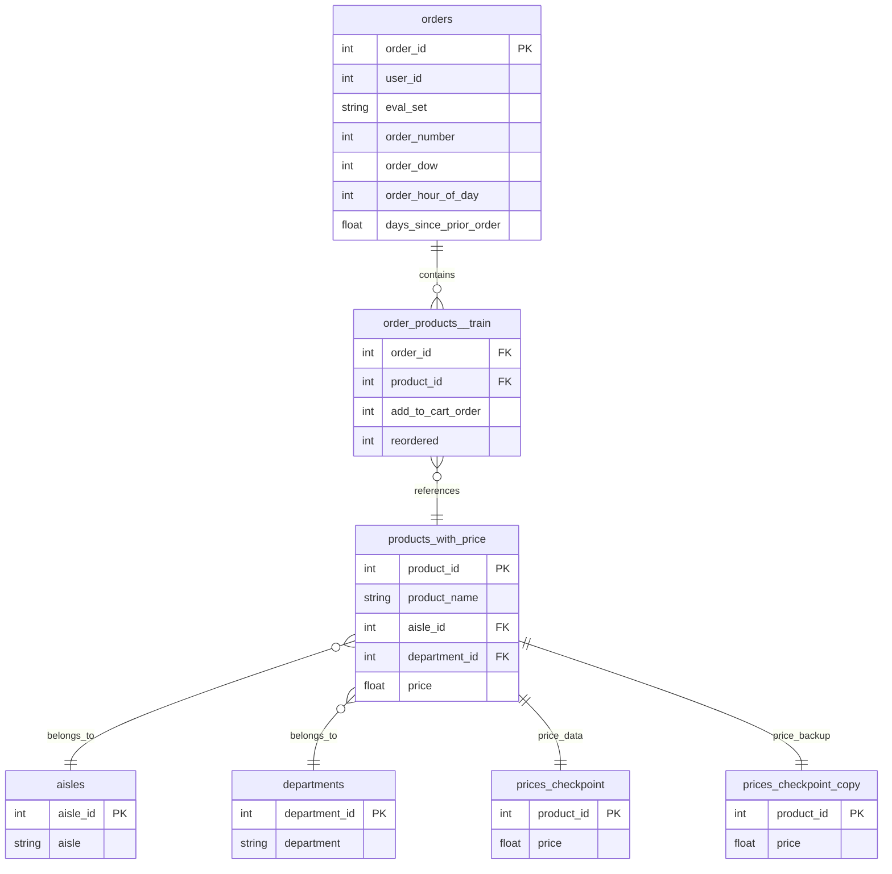

# Instacart Database Schema

## Entity Relationship Diagram

## Table Descriptions

### **Core Tables**

#### **orders** (3,421,083 records)
- **Primary Key**: `order_id`
- **Purpose**: Contains order metadata and customer information
- **Key Fields**:
  - `order_id`: Unique identifier for each order
  - `user_id`: Customer identifier
  - `eval_set`: Dataset split (prior/train/test)
  - `order_number`: Sequential order number for each customer
  - `order_dow`: Day of week (0=Sunday, 6=Saturday)
  - `order_hour_of_day`: Hour when order was placed (0-23)
  - `days_since_prior_order`: Days since customer's previous order

#### **order_products__train** (1,384,617 records)
- **Purpose**: Junction table linking orders to products
- **Key Fields**:
  - `order_id`: References orders.order_id
  - `product_id`: References products_with_price.product_id
  - `add_to_cart_order`: Order in which product was added to cart
  - `reordered`: Whether product was reordered (1=yes, 0=no)

#### **products_with_price** (49,688 records)
- **Primary Key**: `product_id`
- **Purpose**: Product catalog with pricing information
- **Key Fields**:
  - `product_id`: Unique identifier for each product
  - `product_name`: Name/description of the product
  - `aisle_id`: References aisles.aisle_id
  - `department_id`: References departments.department_id
  - `price`: Product price in dollars

### **Reference Tables**

#### **aisles** (134 records)
- **Primary Key**: `aisle_id`
- **Purpose**: Product aisle categorization
- **Key Fields**:
  - `aisle_id`: Unique identifier for each aisle
  - `aisle`: Name/description of the aisle

#### **departments** (21 records)
- **Primary Key**: `department_id`
- **Purpose**: Product department categorization
- **Key Fields**:
  - `department_id`: Unique identifier for each department
  - `department`: Name/description of the department

### **Price Tables**

#### **prices_checkpoint** (49,688 records)
- **Primary Key**: `product_id`
- **Purpose**: Alternative price data source
- **Key Fields**:
  - `product_id`: References products_with_price.product_id
  - `price`: Product price in dollars

#### **prices_checkpoint_copy** (49,688 records)
- **Primary Key**: `product_id`
- **Purpose**: Backup price data source
- **Key Fields**:
  - `product_id`: References products_with_price.product_id
  - `price`: Product price in dollars

## Relationship Types

### **One-to-Many Relationships**
- **orders → order_products__train**: One order can contain multiple products
- **products_with_price → order_products__train**: One product can appear in multiple orders

### **Many-to-One Relationships**
- **order_products__train → orders**: Many order-product combinations belong to one order
- **order_products__train → products_with_price**: Many order-product combinations reference one product
- **products_with_price → aisles**: Many products belong to one aisle
- **products_with_price → departments**: Many products belong to one department

### **One-to-One Relationships**
- **products_with_price ↔ prices_checkpoint**: Each product has one price record
- **products_with_price ↔ prices_checkpoint_copy**: Each product has one backup price record

## Business Logic

### **Order Flow**
1. Customer places an order (creates record in `orders`)
2. Customer adds products to cart (creates records in `order_products__train`)
3. Each product is categorized by aisle and department
4. Pricing information is available from multiple sources

### **Data Analysis Capabilities**
- **Market Basket Analysis**: Analyze which products are bought together
- **Customer Segmentation**: Group customers by purchase patterns
- **Price Analysis**: Compare pricing across departments and products
- **Inventory Planning**: Understand product popularity and associations
- **Revenue Analysis**: Calculate order values and product profitability

### **Key Insights Available**
- Product associations and cross-selling opportunities
- Customer purchase patterns and preferences
- Department and aisle performance
- Price sensitivity and elasticity
- Reorder behavior and customer loyalty 